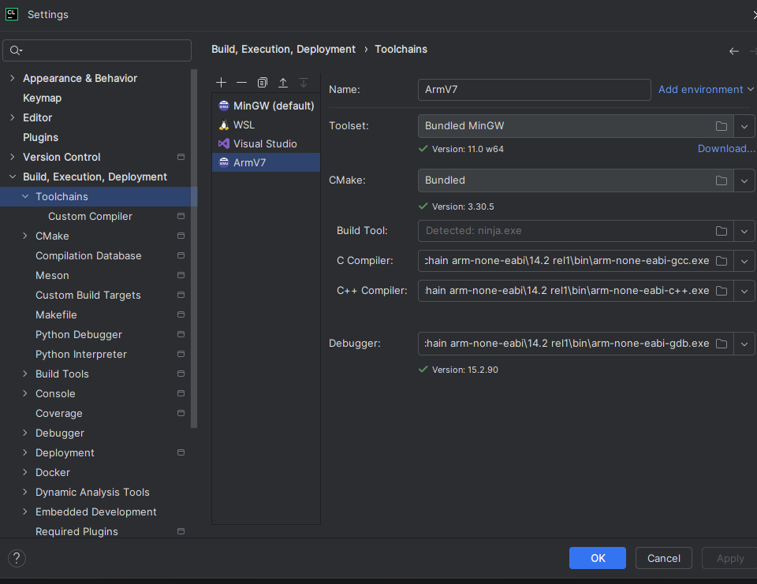
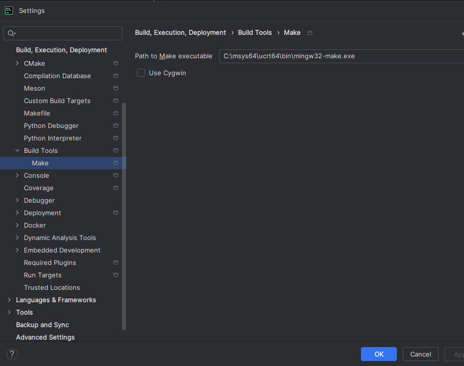
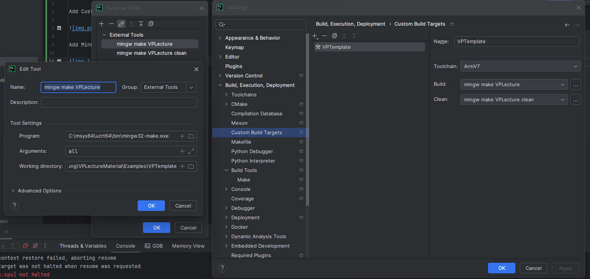
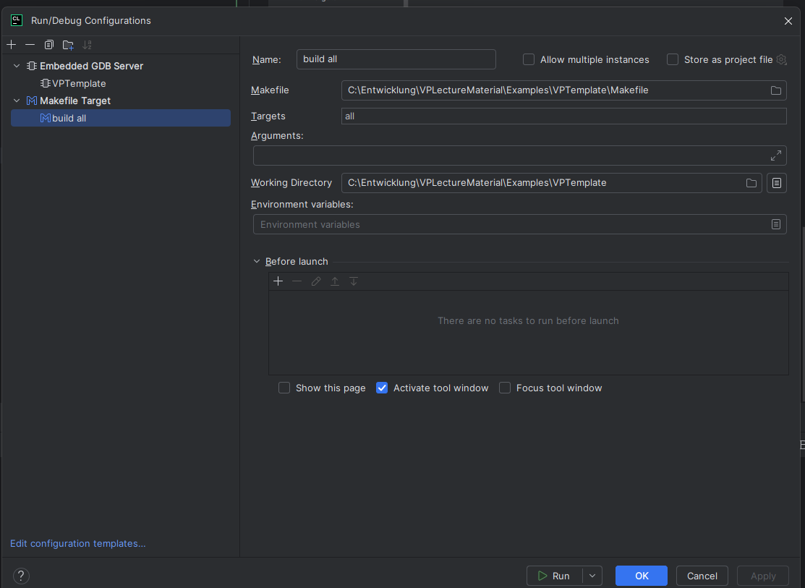
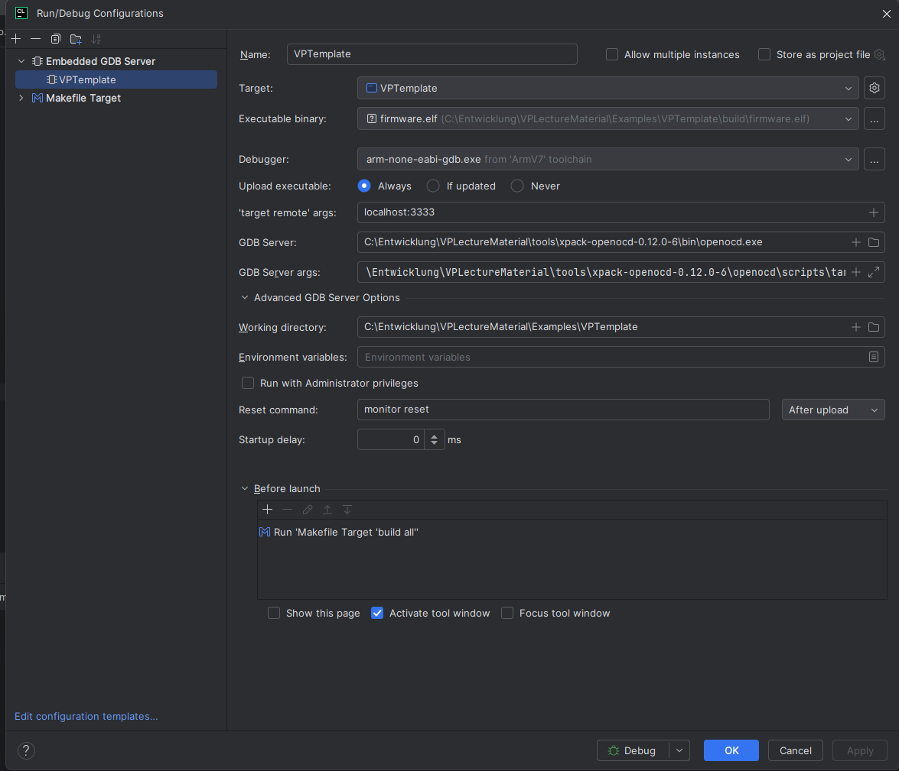

# VPLectureMaterial

## Setup GDP on CLion

Add Custom MinGW Toolchain

Add MinGW CMake as Make

Setup Custom Build Target

Build Configuration

GDB Configuration

With the following Parameters `-f C:\Entwicklung\VPLectureMaterial\tools\xpack-openocd-0.12.0-6\openocd\scripts\interface\stlink.cfg -f C:\Entwicklung\VPLectureMaterial\tools\xpack-openocd-0.12.0-6\openocd\scripts\target\stm32g4x.cfg`